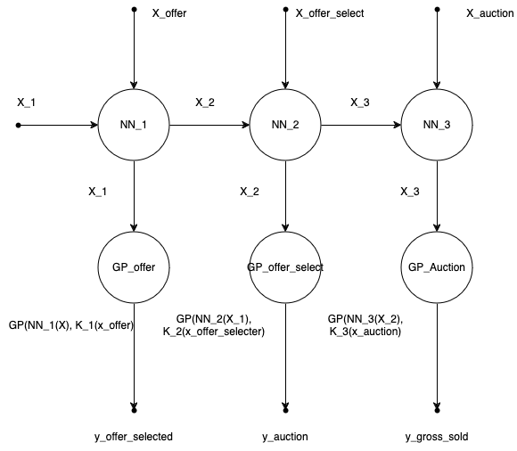
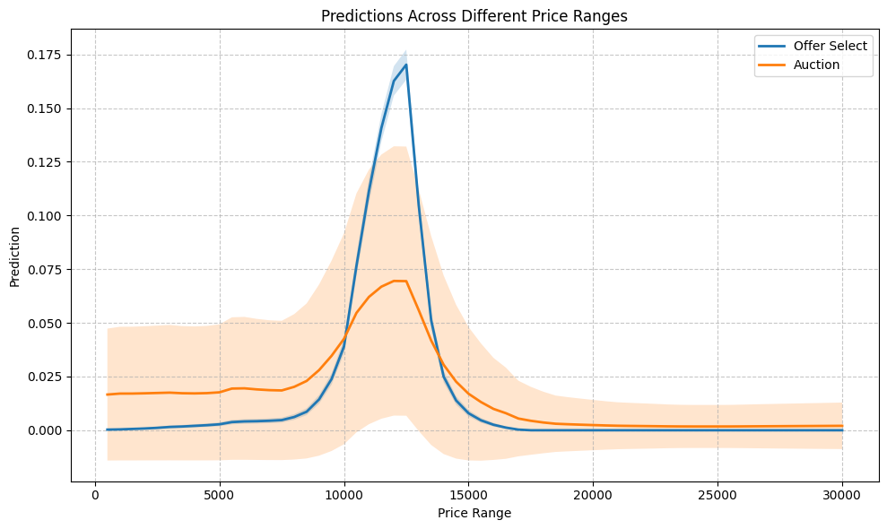

# Car Pricing Model

This repository contains the technical assignment on modeling and predicting car sale outcomes. The approach combines Gaussian Processes (GPs) with Neural Networks (NNs) in a hierarchical state-space model, addressing both standard and high-end car data challenges.

---

## Model Definition and Architecture

### Definition

For a dataset $ \mathcal{X} $, each data point is represented as  
$ x_i = \{x_{i1}, x_{i2}, \ldots, x_{id}\} \in \mathbb{R}^d, $
with $ d $ features and $ N $ data points. The full dataset is given by  
$ \{ (x_i, y_i) \,|\, x_i \in \mathbb{R}^d,\, y_i \in \{0, 1\} \}_{i=1}^N, $
where $ y_i $ indicates whether the car is sold.

### Model Overview

The model uses a combination of Gaussian Processes and Neural Networks:

- **Neural Networks (NN):** Handle categorical data and provide outputs that serve as the mean functions for the Gaussian Process models.
- **Gaussian Processes (GP):** Capture the probability distribution over time in three sequential stages (offer, offer select, auction) with dedicated GP models.

#### Hierarchical Gaussian Process Classification Model

The stages are defined as follows:

1. **Offer Stage:**  
   $
   x_1 \sim NN_{\text{offer}}(x) \quad \text{and} \quad f_{\text{offer}}|x_1 \sim \mathcal{GP}(NN_{\text{offer}}(x), k_{\text{offer}}(x,x'))
   $
   $
   y_{\text{offer}} \sim \text{sigmoid}(f_{\text{offer}}(x))
   $

2. **Offer Select Stage:**  
   $
   x_2 | x_1 \sim NN_{\text{offer_select}}(x_1) \quad \text{and} \quad f_{\text{offer_select}}|x_2 \sim \mathcal{GP}(NN_{\text{offer_select}}(x_1), k_{\text{offer_select}}(x,x'))
   $
   $
   y_{\text{offer_select}} \sim \text{sigmoid}(f_{\text{offer_select}}(x))
   $

3. **Auction Stage:**  
   $
   x_3 | x_2 \sim NN_{\text{offer}}(x_2) \quad \text{and} \quad f_{\text{auction}}|x_3 \sim \mathcal{GP}(NN_{\text{offer}}(x_2), k_{\text{auction}}(x,x'))
   $
   $
   y_{\text{auction}} \sim \text{sigmoid}(f_{\text{auction}}(x))
   $

#### Model Architecture Diagram

Below is the model architecture diagram:

### Input Features

- **Numerical Columns:**
    - `mileage_per_year`
    - `year_used` (0–23)
    - `previous_keepers_plt` (1–21)
    - `high_end` (0–1)
    - `model_avg_price`
    - `model_std_price`
    - `make_avg_price`
    - `make_std_price`

- **Categorical Columns (used by the NN):**
    - `make` (56 categories)
    - `generic_model` (533 categories)
    - `fuel` (Petrol, Diesel, Hybrid, Electric, Gas bi-fuel, Other)
    - `body` (16 categories)
    - `transmission` (Manual, Automatic, Semi-automatic, CVT, Others)

#### Masking & Decision Variable

- **Masking:**
    - `offer_accept` (Binary): Indicates if the offer is accepted (based on the existence of `offer_select` data).
    - `auction_accept` (Binary): Indicates if the auction is accepted.

- **Decision Variable:**
    - `gross_sold` (Binary): Indicates whether the car is sold.

#### Feature Engineering

1. **Brand Classification:** (e.g., Low vs. High for brands like Mercedes, Porsche, etc.)
2. **Years Used:** Current Year minus Manufacture Year.
3. **Mileage per Year:** Mileage divided by Years Used.
4. **Price Statistics:** Average and standard deviation for both make and model.
5. **Time Features:**
    - Hour of the day (0–23)
    - Time difference (log-transformed)
    - Hour of the day (sine and cosine transformations for periodicity)

### GP Model Details

#### Offer GP Model

- **Input:** `hour_of_day_offer`, `guide_price_offer`, `mileage_offer`
- **Mean Function:** Output from $ NN_{\text{offer}}(x) $.
- **Kernel:**  
  A combination of the RBF kernel and a periodic kernel:
  $
  k_{\text{offer}}(x,x') = \theta_1 \, k_{\text{RBF}}(x,x') + \theta_2 \, k_{\text{hourly}}(x_{\text{hour}}, x'_{\text{hour}})
  $
- **Output:** Probability of offer acceptance.

#### Offer Selection GP Model

- **Input:** `mileage_offer_select`, `time_diff_offer_select_minutes_log`, `hour_of_day_offer_select`, `high_end`
- **Mean Function:** Output from $ NN_{\text{offer_select}}(x) $.
- **Kernel:**  
  Uses the Matern 5/2 kernel along with a periodic kernel:
  $
  k_{\text{offer_select}}(x,x') = \theta_3 \, k_{\text{Matern}}(x,x') + \theta_4 \, k_{\text{hourly}}(x_{\text{hour}}, x'_{\text{hour}})
  $
- **Output:** Probability of the offer being selected.

#### Auction GP Model

- **Input:** `timestamp_auction`, `guide_price_auction`, `mileage_auction`, `price_diff_auction`, `time_diff_auction_minutes_log`, `hour_of_day_auction`
- **Mean Function:** Output from $ NN_{\text{offer}}(x) $.
- **Kernel:**  
  Similar to the offer selection model:
  $
  k_{\text{auction}}(x,x') = \theta_5 \, k_{\text{Matern}}(x,x') + \theta_6 \, k_{\text{hourly}}(x_{\text{hour}}, x'_{\text{hour}})
  $
- **Output:** Probability of the car being sold.

### Loss Function

The training objective uses Stochastic Variational Inference (SVI) to optimise the Evidence Lower Bound (ELBO) for each stage:

$
\text{ELBO}_{\text{stage}} = \mathbb{E}_{q(f_i)} \left[ \log p(y_i \,|\, f_i) \right] - \text{KL}(q(u_i) \| p(u_i)),
$

with the overall loss given by:

$
\mathcal{L} = \text{ELBO}_{\text{offer}} + \text{ELBO}_{\text{offer_select}} + \text{ELBO}_{\text{auction}}.
$

For mini-batch training, the loss is appropriately scaled to represent the full dataset.

### Exploratory Data Analysis and Model Training

Detailed EDA, pre-processing steps, training procedures, and results are available in the accompanying Jupyter Notebook.

### Alternative Approaches

- **Bayesian Neural Networks (BNN):** An alternative for modeling state transitions, though uncertainty is primarily addressed via GP.
- **Bayesian Models for Categorical Data:** May be employed to better handle categorical features but at the cost of increased complexity.

---

### Overview

High-end car sales are rare (less than 0.5% of the total data), and straightforward grouping by brand or model can lead to under-fitting. Two strategies are discussed:

1. **Data Engineering:**
    - Group the data by brand and add a binary `highend` column.
    - Extend the categorisation to include price levels such as Low-end, Mid-range, High-end, and Luxury.
    - Introduce new features like `Mean Brand Price` and `Std Brand Price` to capture brand-specific pricing dynamics.

2. **Modeling Approaches:**
    - **Neural Network Approach:** Use the `highend` column as an input feature to better capture patterns in high-end car sales.
    - **Hierarchical Modeling (Partial Pooling):**  
      Separate GP models for high-end and low-end cars can be defined. For example, in the offer stage:
      $
      f_{\text{offer_highend}} \sim \mathcal{GP}(m_{\text{offer_highend}}(x), k_{\text{offer_highend}}(x, x'))
      $
      $
      f_{\text{offer_lowend}} \sim \mathcal{GP}(m_{\text{offer_lowend}}(x), k_{\text{offer_lowend}}(x, x'))
      $

#### Visualisations

**Probability distribution of GOLF being sold in an auction over price:**

#### Sampling Techniques

To address data imbalance, over-sampling methods like SMOTE can be applied to high-end car data, ensuring the model learns adequately from these rare cases.

---
